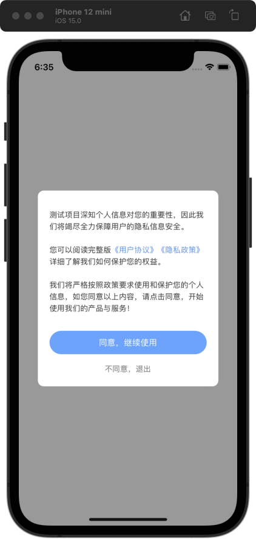

# lsj-PrivateProtocolAlert

[](https://travis-ci.org/lsj/lsj-PrivateProtocolAlert)
[](https://cocoapods.org/pods/lsj-PrivateProtocolAlert)
[](https://cocoapods.org/pods/lsj-PrivateProtocolAlert)
[](https://cocoapods.org/pods/lsj-PrivateProtocolAlert)

## 修订历史

| 文档版本 | 修订日期   | 修订说明               |
|----------|------------|------------------------|
| v0.5.0   | 2022.11.13 | 将 block 改为 delegate |
| v0.4.0   | 2022.10.11 | 移除所有三方库，使用更简洁的方式代替 |


## Overview

为了快速解决审核问题，需要在第一次启动时弹出协议弹窗，用户同意后，才能进入App，否则退出App


|  |  |
|---|--:|

## Usage
```

@interface LSJAppDelegate()

@property (nonatomic, strong) LSJPrivateProtocolAlert *alert;

@end


@implementation LSJAppDelegate

- (BOOL)application:(UIApplication *)application didFinishLaunchingWithOptions:(NSDictionary *)launchOptions
{
    // Override point for customization after application launch.
    
    // 用户点击过同意，会直接执行 completionBlock
    _alert = [LSJPrivateProtocolAlert new];
    _alert.appName = @"测试项目";
    _alert.userAgreementURL = [NSURL URLWithString:@"https://www.jianshu.com"];
    _alert.privacyPolicyURL = [NSURL URLWithString:@"https://www.juejin.com"];
    _alert.delegate = self;
    [_alert show];
        
    return YES;
}

-(void)lsjPrivateProtocolAlert_completion{
    _alert = nil;
    self.window = [[UIWindow alloc] initWithFrame:[UIScreen mainScreen].bounds];
    [self.window makeKeyAndVisible];
    self.window.backgroundColor = [UIColor whiteColor];
    self.window.rootViewController = [LSJViewController new];
}

```


### 给按钮设置渐变色
```
CGSize size = alert.sureButton.frame.size;
CAGradientLayer *gl = [CAGradientLayer layer];
gl.frame = CGRectMake(0,0,size.width,size.height);
gl.startPoint = CGPointMake(0, 0.5);
gl.endPoint = CGPointMake(1, 0.5);
gl.colors = @[(__bridge id)[UIColor colorWithRed:235/255.0 green:134/255.0 blue:114/255.0 alpha:1.0].CGColor, (__bridge id)[UIColor colorWithRed:235/255.0 green:91/255.0 blue:143/255.0 alpha:1.0].CGColor];
gl.locations = @[@(0), @(1.0f)];
gl.cornerRadius = size.height/2.0;
gl.masksToBounds = true;

alert.sureButton.layer.shadowColor = [UIColor colorWithRed:235/255.0 green:93/255.0 blue:143/255.0 alpha:0.3].CGColor;
alert.sureButton.layer.shadowOffset = CGSizeMake(0,6);
alert.sureButton.layer.shadowRadius = size.height/2.0;
alert.sureButton.layer.shadowOpacity = 0;
[alert.sureButton.layer insertSublayer:gl below:alert.sureButton.titleLabel.layer];

```

## Example

To run the example project, clone the repo, and run `pod install` from the Example directory first.

## Requirements

## Installation

lsj-PrivateProtocolAlert is available through [CocoaPods](https://cocoapods.org). To install
it, simply add the following line to your Podfile:

```ruby
pod 'lsj-PrivateProtocolAlert', '~> 0.5.0'
```

## Author

lsj, 534016847@qq.com

## License

lsj-PrivateProtocolAlert is available under the MIT license. See the LICENSE file for more info.
