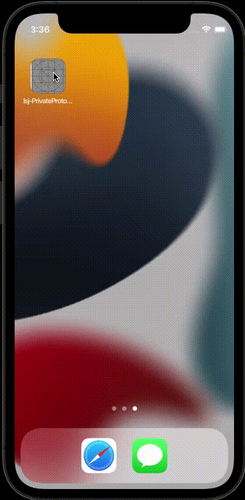

# lsj-PrivateProtocolAlert

[](https://travis-ci.org/lsj/lsj-PrivateProtocolAlert)
[](https://cocoapods.org/pods/lsj-PrivateProtocolAlert)
[](https://cocoapods.org/pods/lsj-PrivateProtocolAlert)
[](https://cocoapods.org/pods/lsj-PrivateProtocolAlert)


## Overview

为了快速解决审核问题，需要在第一次启动时弹出协议弹窗，用户同意后，才能进入App，否则退出App


|  |  |
|---|--:|

## Usage
```

#define kWeakSelf(type)  __weak typeof(type) weak##type = type;
#define kStrongSelf(type) __strong typeof(type) type = weak##type;

@interface LSJAppDelegate()

@property (nonatomic, strong) LSJPrivateProtocolAlert *alert;

@end


@implementation LSJAppDelegate

- (BOOL)application:(UIApplication *)application didFinishLaunchingWithOptions:(NSDictionary *)launchOptions
{
    // Override point for customization after application launch.
    
    // 用户点击过同意，会直接执行 completionBlock
    _alert = [LSJPrivateProtocolAlert new];
    _alert.appName = @"测试项目";
    _alert.userAgreementURL = [NSURL URLWithString:@"https://www.jianshu.com"];
    _alert.privacyPolicyURL = [NSURL URLWithString:@"https://www.juejin.com"];
    __weak typeof(self) weakSelf = self;
    _alert.completionBlock = ^{
        __strong typeof(self) strongSelf = weakSelf;
        [strongSelf startApplication:application didFinishLaunchingWithOptions:launchOptions];
    };
    [_alert show];
    
    return YES;
}

-(void)startApplication:(UIApplication *)application didFinishLaunchingWithOptions:(NSDictionary *)launchOptions{
    self.window = [[UIWindow alloc] initWithFrame:[UIScreen mainScreen].bounds];
    [self.window makeKeyAndVisible];
    self.window.backgroundColor = [UIColor whiteColor];
    self.window.rootViewController = [LSJViewController new];
}

```

### LSJPrivateProtocolAlert.h
```
// 自定义确定按钮的样式
@property (nonatomic,strong) UIButton *sureButton;/**< 确认按钮 */

@property (nonatomic,strong) NSString *appName;/**< 设置应用名称 */
@property (nonatomic,strong) UIColor *nomalTextColor;/**<  设置文字颜色 Default: 333333 */
@property (nonatomic,strong) UIColor *highlightColor;/**<  设置《用户协议》《隐私政策》颜色 Default: 4A90E2 */


// MARK: 隐私政策
// 设置 URL
@property (nonatomic,strong) NSURL *userAgreementURL;/**< 用户协议地址 */
@property (nonatomic,strong) NSURL *privacyPolicyURL;/**< 隐私政策地址 */
// 或者如果不跳转web可自定义事件
@property (copy, nonatomic) void(^userAgreementClickBlock)(void);
@property (copy, nonatomic) void(^privacyPolicyClickBlock)(void);

// 完成事件
@property (copy, nonatomic) void(^completionBlock)(void);


-(void)show;/**< 显示弹窗 */

```


### 给按钮设置渐变色
```
CGSize size = alert.sureButton.frame.size;
CAGradientLayer *gl = [CAGradientLayer layer];
gl.frame = CGRectMake(0,0,size.width,size.height);
gl.startPoint = CGPointMake(0, 0.5);
gl.endPoint = CGPointMake(1, 0.5);
gl.colors = @[(__bridge id)[UIColor colorWithRed:235/255.0 green:134/255.0 blue:114/255.0 alpha:1.0].CGColor, (__bridge id)[UIColor colorWithRed:235/255.0 green:91/255.0 blue:143/255.0 alpha:1.0].CGColor];
gl.locations = @[@(0), @(1.0f)];
gl.cornerRadius = size.height/2.0;
gl.masksToBounds = true;

alert.sureButton.layer.shadowColor = [UIColor colorWithRed:235/255.0 green:93/255.0 blue:143/255.0 alpha:0.3].CGColor;
alert.sureButton.layer.shadowOffset = CGSizeMake(0,6);
alert.sureButton.layer.shadowRadius = size.height/2.0;
alert.sureButton.layer.shadowOpacity = 0;
[alert.sureButton.layer insertSublayer:gl below:alert.sureButton.titleLabel.layer];

```

## Example

To run the example project, clone the repo, and run `pod install` from the Example directory first.

## Requirements

## Installation

lsj-PrivateProtocolAlert is available through [CocoaPods](https://cocoapods.org). To install
it, simply add the following line to your Podfile:

```ruby
pod 'lsj-PrivateProtocolAlert', '~> 0.4.0'
```

## Author

lsj, 534016847@qq.com

## License

lsj-PrivateProtocolAlert is available under the MIT license. See the LICENSE file for more info.
